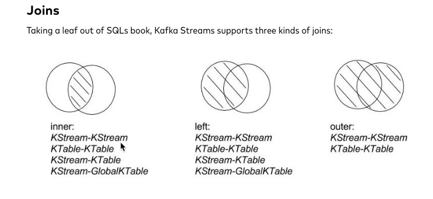
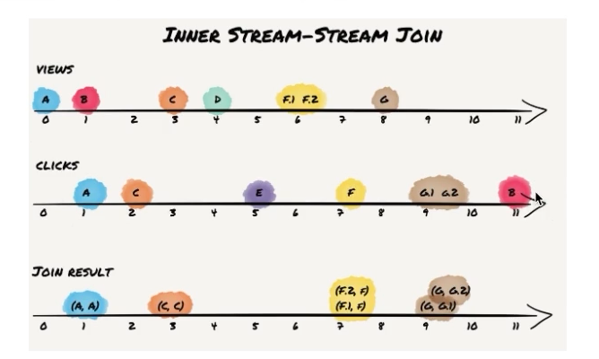
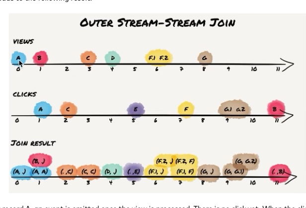
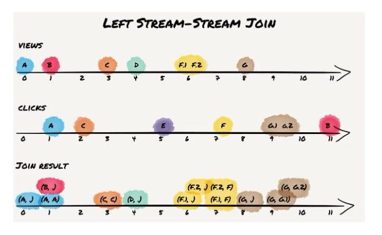

# Kafka Streams의 Join 정리 (KStream-KStream Join 중심)

> 원문: [Crossing the Streams – Joins in Apache Kafka (Confluent Blog)](https://www.confluent.io/blog/crossing-streams-joins-apache-kafka/)
> 저자: Florian Troßbach, Matthias J. Sax (Confluent)

---

## 1. 핵심 개념 요약

- **KStream**: 카프카 토픽처럼 키-값 쌍이 순서대로 흘러가는 무상태(stateless) 스트림. 동일 키가 여러 번 나와도 각각 별개의 레코드로 취급된다.
- **KTable**: 특정 키에 대한 "최신 값"만 유지하는 체인지로그(changelog) 스트림. 새 메시지가 들어오면 이전 값을 덮어쓴다.
- 예시로 자주 드는 것이 IP 방문자 카운트다. KStream으로 카운트하면 같은 IP의 재방문까지 모두 합산되고, KTable로 카운트하면 고유 방문자(distinct IP) 수가 된다.
- KStream-KStream 조인은 반드시 **시간 윈도우(window)** 를 지정해야 하며, 이는 이벤트 타임(event time) 기준으로 동작한다. 반면 KTable-KTable 조인은 윈도우가 없다.

## 2. 세 가지 조인 종류 (개요)

Kafka Streams는 SQL의 조인 개념을 참고하여 크게 세 가지 조인을 지원한다.

| 조인 종류 | 의미 |
|---|---|
| **Inner Join** | 두 입력 소스 모두에 같은 키의 레코드가 있을 때만 결과를 emit |
| **Left Join** | 왼쪽(주) 입력 소스의 모든 레코드에 대해 결과를 emit (상대편에 매칭이 없으면 null) |
| **Outer Join** | 양쪽 입력 소스 중 어느 한쪽에서라도 레코드가 오면 결과를 emit (매칭이 없으면 반대편은 null) |

지원 조합 정리:
- KStream-KStream: inner / left / outer 모두 지원
- KTable-KTable: inner / left / outer 모두 지원
- KStream-KTable, KStream-GlobalKTable: inner / left만 지원 (outer는 미지원)

이 문서에서는 그중 **KStream-KStream 조인** 3종(Inner, Outer, Left)을 예제와 함께 정리한다.

### 예제 시나리오
온라인 광고 도메인을 예로 든다. "조회(view)" 이벤트 스트림과 "클릭(click)" 이벤트 스트림이 있고, 같은 광고 ID를 키로 공유한다. 아래 7가지 상황을 A~G 레코드로 시뮬레이션한다.
- A: 클릭이 조회 1초 뒤 도착
- B: 클릭이 조회 11(실제로는 12)초 뒤 도착 (윈도우 밖)
- C: 조회가 클릭 1초 뒤 도착 (순서가 뒤바뀐 경우)
- D: 조회만 있고 클릭 없음
- E: 클릭만 있고 조회 없음
- F: 조회가 두 번(F.1, F.2) 연속 발생 후 클릭 1개
- G: 조회 1개 후 클릭이 두 번(G.1, G.2) 연속 발생

윈도우는 10초로 설정한다.

---

## 3. Inner KStream-KStream Join

두 스트림에 같은 키가 **윈도우 시간 내에** 모두 존재할 때만 결과가 생성된다.

**결과 해석**
- **A, C**: 도착 순서가 바뀌었어도(클릭이 먼저 오든 조회가 먼저 오든) 10초 이내에 둘 다 들어왔으므로 정상적으로 조인된다. → Inner 조인의 윈도우는 대칭적(과거·미래 양방향)이다.
- **B**: 두 스트림 모두 같은 키를 갖고 있지만, 시간 간격이 윈도우(10초)를 벗어나 조인되지 않는다.
- **D, E**: 애초에 상대 스트림에 매칭되는 키가 없으므로 조인 결과가 없다.
- **F, G**: 같은 키가 한쪽 스트림에서 두 번 나오는 경우로, 각각 두 개의 결과 레코드가 생성된다.
- 조인 순서를 강제하는 옵션(클릭이 조회 "이후"에만 오도록 설정 등)을 쓰면 C처럼 뒤바뀐 순서의 결과는 제외될 수 있다.
- Inner 조인은 레코드가 타임스탬프 순서대로 처리되지 않아도 **최종 결과 자체는 항상 동일**하다(순서만 영향받을 뿐).

---

## 4. Outer KStream-KStream Join

한쪽 스트림에서 이벤트가 처리될 때마다 매번 결과를 emit한다. 상대 스트림에 같은 키가 윈도우 안에 이미 있으면 두 값을 합쳐서, 없으면 방금 들어온 쪽만으로 결과를 만든다.

**결과 해석**
- **A**: 조회가 먼저 처리되며 클릭이 없는 상태로 1건 emit, 이후 클릭이 도착하면 조인된 결과가 추가로 1건 더 emit된다.
- **B**: 윈도우를 벗어나므로 조회/클릭 각각 독립적으로 2건이 emit된다(서로 합쳐지지 않음).
- **D, E**: 상대가 없는 채로 각각 1건씩 emit된다.
- **F**: 뷰가 두 번 연속 오므로 즉시 2건이 emit되고, 이후 클릭과 매칭되며 다시 2건이 추가되어 총 4건이 나온다.
- **G**: 조회가 먼저 온 뒤 클릭 두 개가 바로 조인되므로 총 3건만 생성된다(F보다 1건 적음).
- Outer 조인은 Left 조인과 유사하지만 **대칭적**이며 양쪽 스트림의 레코드를 모두 보존한다는 점이 특징이다.

---

## 5. Left KStream-KStream Join

왼쪽(주) 스트림에 이벤트가 도착할 때마다 매번 결과를 emit한다. 오른쪽 스트림에 이벤트가 도착하는 경우에는, 이전에 왼쪽 스트림에 같은 키가 이미 존재했을 때만 조인 결과를 emit한다(즉, 오른쪽 단독 이벤트는 결과를 만들지 않는다).

**결과 해석**
- Inner 조인의 모든 결과를 포함한다.
- **B, D**: 왼쪽(view) 스트림의 레코드이므로, 매칭 여부와 상관없이 결과에 포함된다(매칭이 없으면 오른쪽은 null "·"로 표시).
- **A, F.1/F.2, G**: 오른쪽에 매칭되는 키가 당시 윈도우에 없었기 때문에 null과 함께 결과에 포함된다 — 이는 일반 SQL 조인에서는 나오지 않는 특징으로, 스트림 조인이 "레코드가 도착하는 시점"마다 즉시 계산되기 때문에 발생한다.
- 이 조인은 **처리 순서에 대한 런타임 의존성**을 가진다. 즉 이벤트 타임 순서대로 처리되지 않으면 (inner 조인 결과에 해당하지 않는) 추가적인 null 매칭 결과가 달라질 수 있다. 다만 inner 조인 결과와 왼쪽 스트림의 모든 레코드가 포함된다는 점은 항상 보장된다.

---

## 6. 세 조인 비교 요약

| 구분 | Inner | Outer | Left |
|---|---|---|---|
| 결과 생성 시점 | 양쪽 다 윈도우 내 매칭될 때만 | 어느 한쪽이라도 이벤트가 오면 | 왼쪽 이벤트가 오거나, 오른쪽 이벤트가 왼쪽에 매칭될 때 |
| 대칭성 | 대칭 | 대칭 | 비대칭 (왼쪽 우선) |
| 매칭 안 된 레코드 처리 | 결과에서 제외 | 양쪽 모두 null로 보존 | 왼쪽만 null로 보존 |
| 처리 순서 영향 | 최종 결과에는 영향 없음(순서만) | 있음 | 있음 (null 매칭 건수에 영향) |

---

### 참고
- 원문에서는 이후 KTable-KTable, KStream-KTable, KStream-GlobalKTable 조인까지 다루고 있으며, 파티셔닝/코파티셔닝 요구사항도 설명한다.
- 원문 링크: https://www.confluent.io/blog/crossing-streams-joins-apache-kafka/
